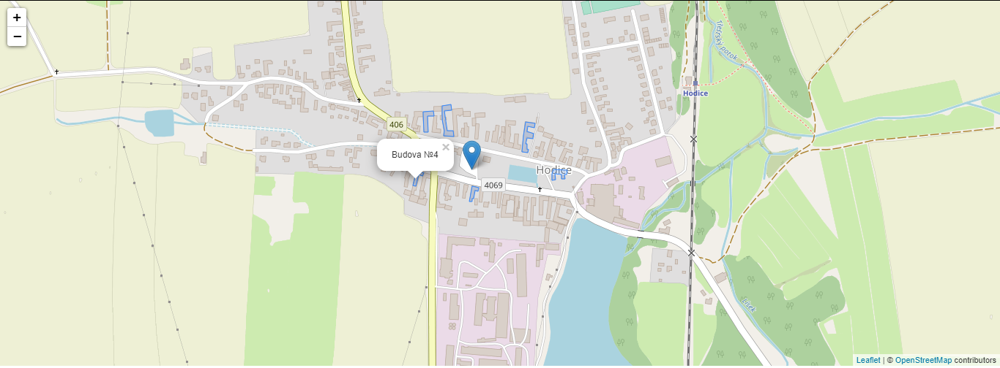
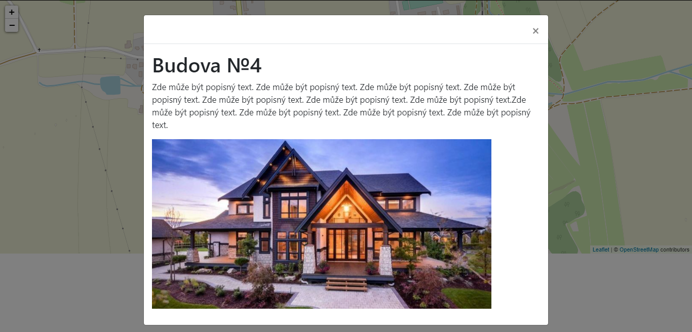
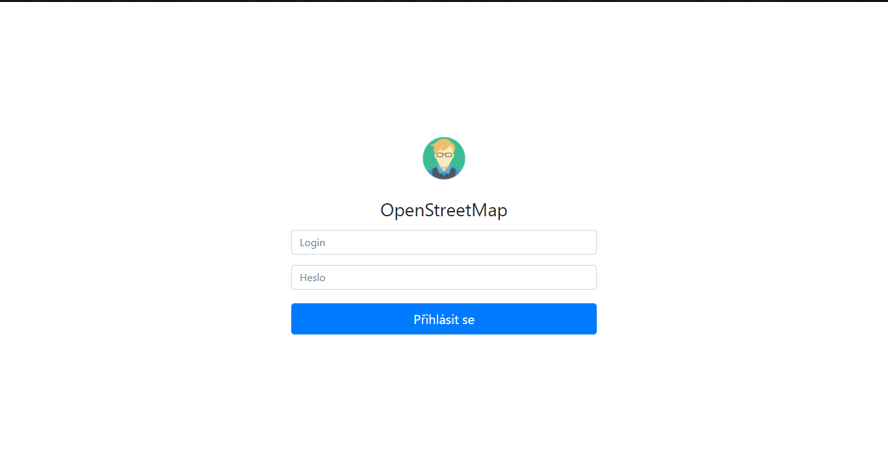
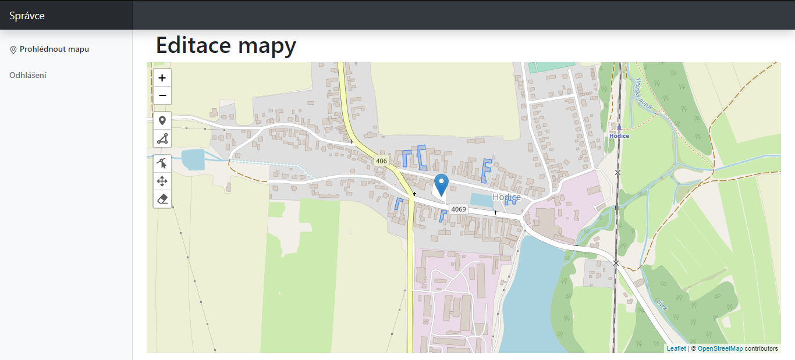
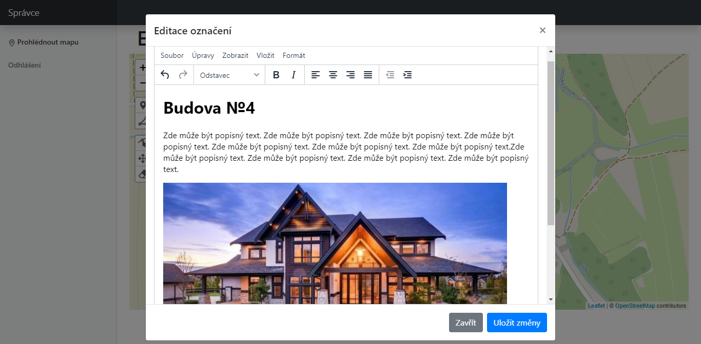
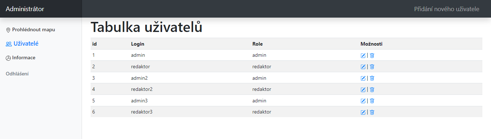
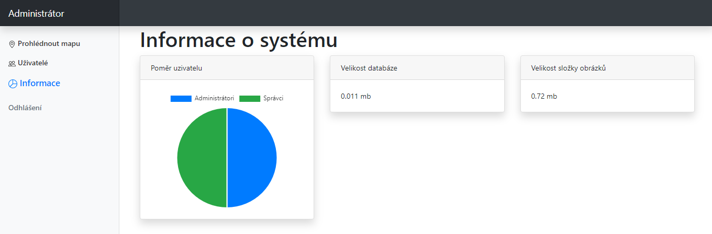
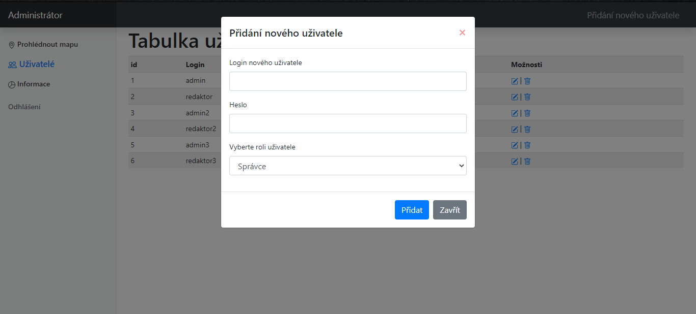

# Editorial system for management of interactive image-based map
## cms image map
See on link if hosting is worked
 [link](https://khoroshavin.xyz/bp/system_map/)
# 
Or screenshots here

# TO CHANGE!

In file config.php
- change DB_PASS, DB_LOGIN, DB_NAME

In folder admin in file admin_grafs.php
- change DB_NAME on line 17,57,58

